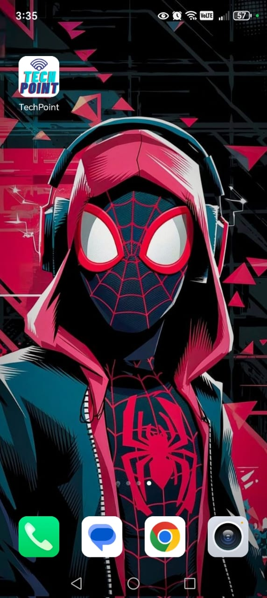
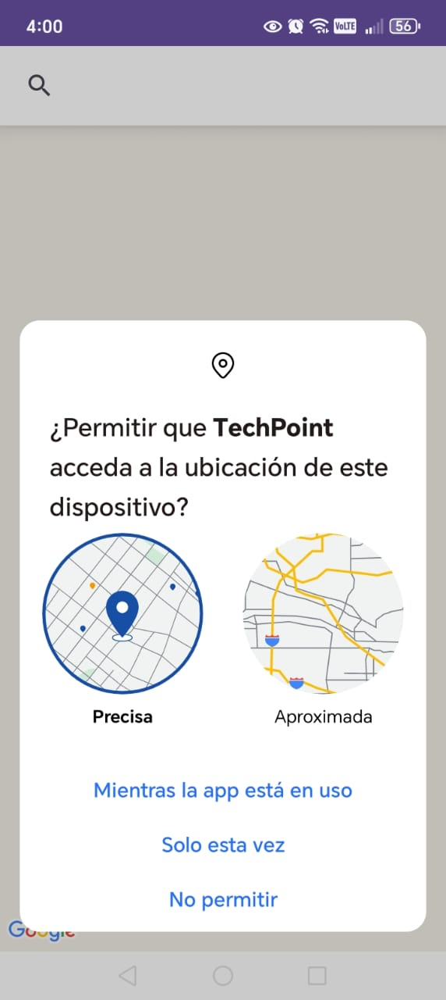
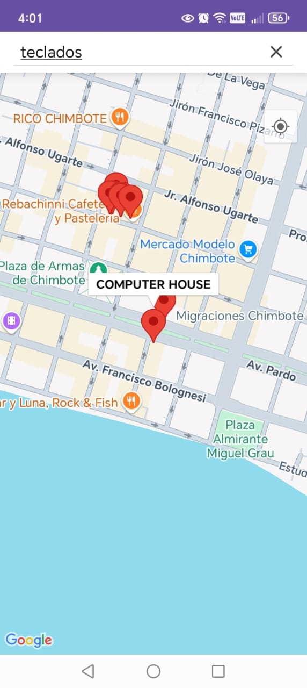
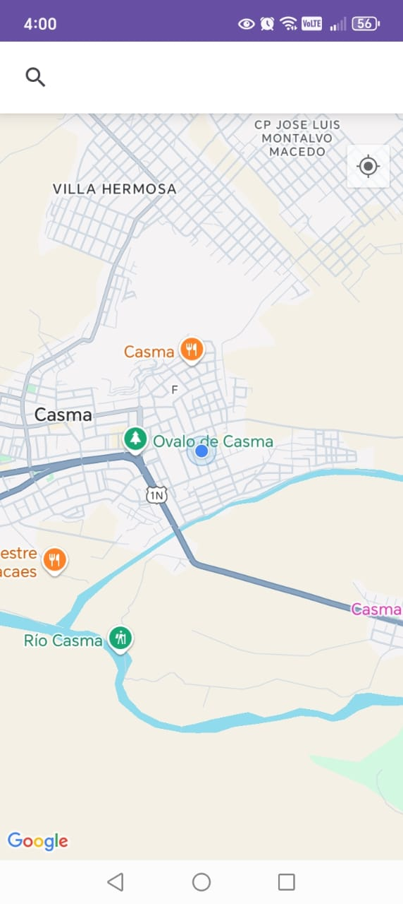
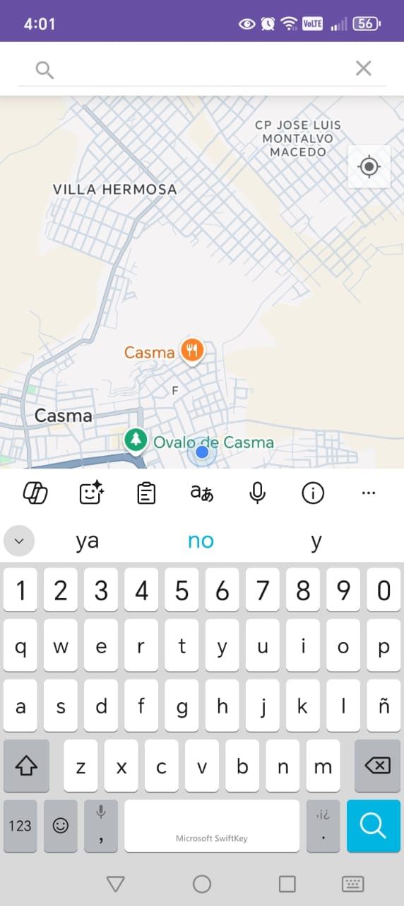
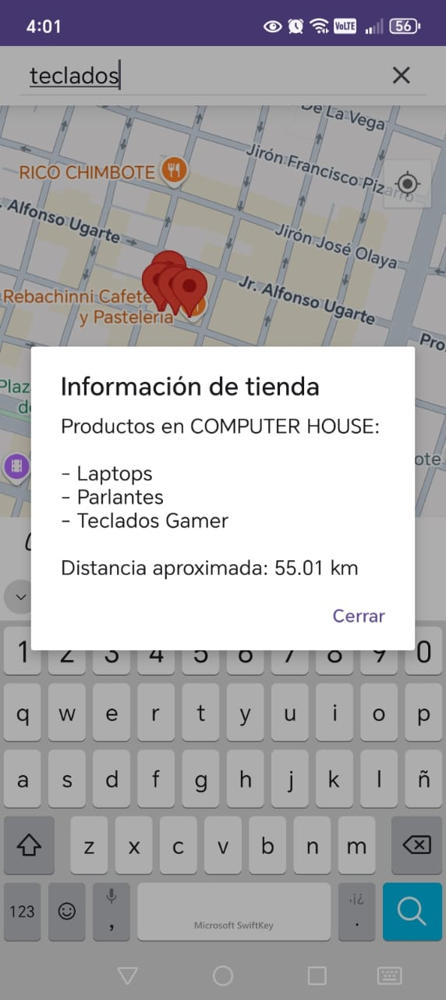
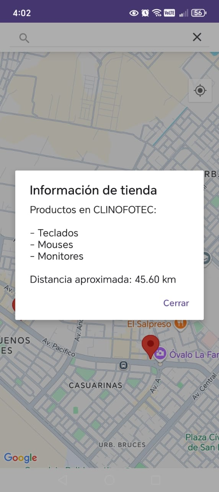

# 🗺️ App Buscador de Productos con Google Maps

**Buscador de Productos con Google Maps** es una aplicación Android desarrollada en **Java**, que permite al usuario visualizar tiendas cercanas, buscar productos específicos y conocer la distancia desde su ubicación actual hasta las tiendas que los ofrecen.

Esta app combina Google Maps con funcionalidades interactivas, proporcionando una experiencia visual clara y útil para usuarios que buscan tecnología en su ciudad. Al seleccionar un producto, se muestran las tiendas disponibles, los productos que ofrecen y la distancia exacta desde la ubicación actual.

---

## 🎯 Objetivo

Facilitar la localización de productos tecnológicos a través de un mapa interactivo con funciones de búsqueda y cálculo de distancia en tiempo real.

---

## 🚀 Funcionalidades

- 🗺️ Visualización de tiendas locales con marcadores en Google Maps
- 🔍 Búsqueda por nombre de producto con filtrado inteligente
- 📍 Uso de la ubicación actual del dispositivo
- 📏 Cálculo automático de la distancia entre el usuario y las tiendas que tienen el producto
- 💬 Cuadro de diálogo informativo con lista de productos y distancia exacta
- 📌 Marcadores personalizados con nombres de tiendas

---

## 🧩 Componentes y Librerías

- **Google Maps API**
- **Java (Android API 30)**
- **LocationManager y FusedLocationProviderClient**
- **Material Design 3**
- **AlertDialog para mostrar productos y distancia**

---

## 🗃️ Estructura del Proyecto

📁 app  
└─ 📁 src  
  └─ 📁 main  
    ├─ 📁 java/com/example/mygooglemaps1  
    │  └── MainActivity.java  
    ├─ 📁 res  
    │  ├── layout/activity_main.xml  
    │  ├── values/colors.xml  
    │  ├── values/strings.xml  
    │  └── values/themes.xml  
    └── AndroidManifest.xml

---

## 🧪 Tecnologías Usadas

| Tecnología            | Descripción                                                  |
|----------------------|--------------------------------------------------------------|
| **Java**             | Lenguaje principal del desarrollo                            |
| **Android SDK (API 30)** | Plataforma para el desarrollo móvil Android               |
| **Google Maps API**  | Para mostrar el mapa y los marcadores                        |
| **FusedLocationProviderClient** | Para obtener la ubicación precisa del usuario     |
| **LocationManager**  | Alternativa para acceder a ubicación mediante sensores       |
| **Material Design 3**| Estilo moderno e intuitivo de interfaz gráfica de usuario     |
| **AlertDialog**      | Para mostrar los productos disponibles y la distancia         |

---

## 🖼️ Capturas de pantalla

### LOGO TECH POINT

### PERMISOS PARA USAR GOOGLE MAPS Y UBICACION EN TIEMPO REAL

### UBICACION DE TIENDAS DE PRODUCTOS DE COMPUTO EN CHIMBOTE

### UBICACION DE TIENDAS DE PRODUCTOS DE COMPUTO EN NUEVO CHIMBOTE

### UBICACION EN TIEMPO REAL

### BUSQUEDA DE PRODUCTO DE COMPUTO

### BUSQUEDA DE PRODUCTO DE COMPUTO

### TIENDA MAS CERCANA CHIMBOTE

### REFERENCIA DE TIENDA CHIMBOTE

### TIENDA MAS CERCANA NUEVO CHIMBOTE

### REFERENCIA DE TIENDA CHIMBOTE

---

## ⚙️ Instalación

1. Clona este repositorio:
   
bash
   git clone https://github.com/luxo11GB/TechPoint.git

2. Ábrelo en Android Studio  
3. Ejecuta el proyecto en un emulador o dispositivo físico con Android 11 o superior

## 👨‍💻 Autor

- **Nombre:** LuxoGB11  
- **Carrera:** Estudiante de Ingeniería de Sistemas e Informática  
- **Universidad:** Universidad Nacional del Santa  
- **GitHub:** [https://github.com/luxo11GB](https://github.com/luxo11GB)

## 📄 Licencia

Este proyecto se distribuye bajo la licencia MIT. Consulta el archivo `LICENSE` para más detalles.
